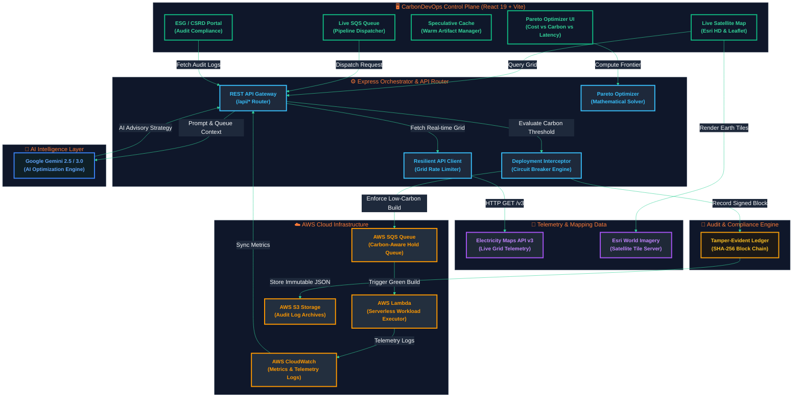
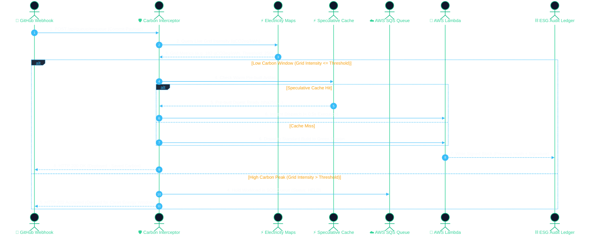

# 🌿 CarbonDevOps

<div align="center">

### **AI-Powered Carbon-Aware CI/CD Orchestrator & ESG Compliance Engine**

*Dynamically intercept, optimize, and route cloud compute workloads to the greenest global AWS regions based on real-time electricity grid carbon intensity ($gCO_2eq/kWh$).*

---

[](https://react.dev/)
[](https://www.typescriptlang.org/)
[](https://vitejs.dev/)
[](https://tailwindcss.com/)
[](https://aws.amazon.com/)
[](https://ai.google.dev/)
[](https://www.electricitymaps.com/)
[](LICENSE)

</div>

---

## 📋 Table of Contents

- [Overview](#-overview)
- [System Architecture](#-system-architecture)
  - [End-to-End Component Flow](#end-to-end-component-flow)
  - [Webhook Execution Sequence](#webhook-execution-sequence)
- [The 6 Core Orchestration Pillars](#-the-6-core-orchestration-pillars)
- [Key Features](#-key-features)
- [Tech Stack](#-tech-stack)
- [REST API Reference](#-rest-api-reference)
- [Project Directory Structure](#-project-directory-structure)
- [Getting Started](#-getting-started)
  - [Prerequisites](#prerequisites)
  - [Environment Configuration](#environment-configuration)
  - [Installation & Execution](#installation--execution)
- [AWS Deployment Guide](#-aws-deployment-guide)
- [ESG & CSRD Audit Compliance](#-esg--csrd-audit-compliance)
- [License](#-license)

---

## 🚀 Overview

Modern cloud engineering teams push hundreds of CI/CD builds daily. Running compute-heavy workloads—such as container builds, automated integration suites, and AI model training—in data centers powered by fossil-fuel grid electricity silently inflates an organization's **Scope 3 Carbon Footprint**.

**CarbonDevOps** functions as an intelligent green middleware orchestrator. Positioned between Git platforms (GitHub Actions, GitLab CI) and cloud compute providers (AWS Lambda, SQS, EC2), CarbonDevOps inspects live grid telemetry ($gCO_2eq/kWh$) across all global AWS regions to dynamically:

1. **Reroute**: Shift latency-tolerant builds to regions with high renewable energy saturation (e.g. Oregon `us-west-2` or Stockholm `eu-north-1`).
2. **Defer**: Hold non-urgent pipelines in carbon-aware SQS queues until local solar/wind energy generation reaches peak windows.
3. **Speculatively Pre-Build**: Warm container artifacts ahead of time during green energy dips, providing near-instantaneous deployment execution upon commit approval.
4. **Audit & Report**: Log immutable CSRD-compliant proof of carbon savings into a tamper-evident cryptographic ledger.

---

## 🎨 System Architecture

### End-to-End Component Flow

The following interactive Mermaid diagram details the structural flow connecting the React 19 Frontend, Express Backend Server, Google Gemini AI Engine, Live Grid Data Providers, AWS Cloud Services, and the Cryptographic Audit Engine.



---

### Webhook Execution Sequence



---

## ⚡ The 6 Core Orchestration Pillars

CarbonDevOps is built upon 6 key green engineering principles:

```
┌──────────────────────────────────────────────────────────────────────────────────┐
│                             CARBONDEVOPS PILLARS                                 │
├───────────────────┬───────────────────┬───────────────────┬──────────────────────┤
│ ⚡ 1. Speculative │ 🎯 2. Pareto      │ 📊 3. Per-Step    │ 🚨 4. SLA Tiered     │
│    Pre-Build      │    Optimizer      │    Profiler       │    Auto-Escalation   │
├───────────────────┴───────────────────┴───────────────────┴──────────────────────┤
│ 🛡️ 5. Resilient Interceptor & Circuit Breaker                                     │
│ ⛓️ 6. Tamper-Evident ESG & CSRD Cryptographic Ledger                              │
└──────────────────────────────────────────────────────────────────────────────────┘
```

1. **⚡ Speculative Pre-Build & Hold Engine**
   - Pre-executes static dependencies and container layer builds during transient green energy windows before code merge.
   - Reduces final pipeline deployment latency from **~180 seconds down to < 0.5 seconds**.

2. **🎯 Pareto Multi-Objective Optimizer**
   - Solves multi-dimensional trade-offs between **Carbon Footprint ($gCO_2/kWh$)**, **Compute Cost ($/1k Invocations)**, and **Network Latency ($ms$)**.
   - Calculates the Pareto-optimal frontier curve across all 17 AWS regions in real time.

3. **📊 Per-Step Pipeline Carbon Profiling**
   - Breaks down pipeline steps (`CHECKOUT`, `TEST_SUITE`, `DOCKER_BUILD`, `SECURITY_SCAN`, `DEPLOYMENT`).
   - Attributes exact energy consumption and carbon emissions to individual workflow jobs.

4. **🚨 SLA-Tiered Auto-Escalation Policy Engine**
   - Enforces business urgency tiers:
     - `P1_HOTFIX`: Bypasses carbon hold window with automated force-dispatch audit logging.
     - `P2_FEATURE`: Max deferral limit of 60 minutes before SLA escalation.
     - `P3_BATCH`: Holds until optimal renewable energy window.

5. **🛡️ Resilient Interceptor & Circuit Breaker**
   - Integrated fault-tolerant interceptor middleware with automatic exponential backoff, jitter, and circuit-breaker state management (`CLOSED`, `OPEN`, `HALF_OPEN`).

6. **⛓️ ESG & CSRD Tamper-Evident Audit Ledger**
   - Computes SHA-256 cryptographic block hashes linking every execution decision.
   - Provides verified audit proof required for EU Corporate Sustainability Reporting Directive (CSRD) Scope 3 compliance.

---

## ✨ Key Features

- **🌍 HD Esri Satellite Map**: Real-time interactive globe powered by Leaflet and Esri World Imagery displaying regional grid scores and live carbon intensities.
- **⚡ Real-Time Grid Telemetry**: Direct integration with Electricity Maps API v3 with automatic realistic fallback data for offline development.
- **🤖 Google Gemini AI Sustainability Advisor**: Context-aware AI engine providing real-time recommendations for workload migration and carbon reduction strategies.
- **☁️ Native AWS Infrastructure**: SQS-backed queue management, serverless Lambda execution dispatch, and CloudWatch telemetry integration.
- **🧪 Interactive Fault Simulator**: Embedded test suite to simulate SQS timeouts, API rate limits, and verify circuit breaker recovery live in the dashboard.
- **📄 Exportable ESG Reports**: Download structured CSRD Scope 3 reports in JSON format.

---

## 🛠️ Tech Stack

| Category | Technologies |
| :--- | :--- |
| **Frontend Framework** | React 19, TypeScript 5.8, Vite 6.2, Tailwind CSS v4 |
| **UI Components & Icons** | Lucide React, Motion (Framer Motion), Leaflet / React-Leaflet |
| **Backend Runtime** | Node.js, Express.js, `tsx` (TypeScript Execution Engine), `esbuild` |
| **AI Layer** | `@google/genai` (Google Gemini 2.5 Flash / 3.0 Pro) |
| **Cloud & External APIs** | AWS SQS, AWS Lambda, AWS S3, Electricity Maps API v3, Esri ArcGIS |

---

## 📡 REST API Reference

### 1. Live Carbon Intensity Across All AWS Regions
```http
GET /api/carbon/all-regions
```
**Response Sample (`200 OK`):**
```json
{
  "timestamp": "2026-08-01T20:30:00.000Z",
  "isRealApi": false,
  "count": 17,
  "regions": [
    {
      "zoneKey": "US-OR-BPA",
      "regionName": "US West (Oregon)",
      "awsRegion": "us-west-2",
      "carbonIntensity": 110,
      "renewablePct": 94,
      "status": "OPTIMAL",
      "gridScore": 86
    }
  ]
}
```

### 2. Enqueue Webhook Pipeline
```http
POST /api/queue/enqueue
Content-Type: application/json

{
  "repo": "payment-api-service",
  "branch": "main",
  "commitSha": "a1b2c3d",
  "awsRegion": "us-east-1",
  "carbonIntensity": 214,
  "commitAuthor": "Alex Rivera"
}
```

### 3. Google Gemini AI Sustainability Optimization
```http
POST /api/ai-optimize
```
**Response Sample (`200 OK`):**
```json
{
  "recommendation": "Shift high-intensity batch deployments from ap-southeast-1 to us-west-2 where renewable mix is 94%.",
  "potentialSavingsKg": 18.5,
  "optimalRegion": "us-west-2",
  "actionableSteps": [
    "Route non-critical pipelines to Oregon region",
    "Maintain SQS hold for Singapore until grid intensity drops below 400 gCO2eq/kWh",
    "Enable speculative pre-build for nightly test suites"
  ]
}
```

### 4. Circuit Breaker Simulation & Resilience Test
```http
POST /api/deployment/simulate-failure
Content-Type: application/json

{
  "failureType": "SQS_CONNECTION_ERROR",
  "serviceName": "us-east-1-sqs-queue"
}
```

---

## 🗂️ Project Directory Structure

```
CarbonDevOps/
├── .env.example                # Template for environment variables
├── package.json                # Project dependencies & npm scripts
├── server.ts                   # Express server & API endpoints
├── tsconfig.json               # TypeScript configuration
├── vite.config.ts              # Vite bundling configuration
├── src/
│   ├── App.tsx                 # Main application controller
│   ├── main.tsx                # Client entry point
│   ├── index.css               # Global CSS & Tailwind styling
│   ├── types.ts                # TypeScript data interfaces
│   ├── components/             # UI Components & Modules
│   │   ├── AWSRegionsView.tsx      # AWS Regions & Dispatch Controller
│   │   ├── AiAdvisorModal.tsx      # Gemini AI Advisory Modal
│   │   ├── AnalyticsView.tsx       # Analytics & Impact Charts
│   │   ├── DashboardView.tsx       # Overview Dashboard
│   │   ├── DeliverablesModal.tsx   # Code Deliverables Inspector
│   │   ├── DeploymentsView.tsx     # Deployment History
│   │   ├── EsgComplianceView.tsx   # CSRD Tamper-Evident Audit Ledger
│   │   ├── InterceptorMonitorModal.tsx # Resilience & Circuit Breaker Monitor
│   │   ├── LiveCarbonView.tsx      # Leaflet Esri Satellite Map
│   │   ├── Navigation.tsx          # App Navigation Bar
│   │   ├── NewDeploymentModal.tsx  # Pipeline Dispatch Trigger Modal
│   │   ├── ParetoOptimizerView.tsx # Pareto Frontier Trade-Off Curve
│   │   ├── PipelineProfilerModal.tsx # Per-Step Step Carbon Profiler
│   │   ├── QueueView.tsx           # SQS Queue Management
│   │   ├── ReportsView.tsx         # Audit Reports & Exports
│   │   ├── SettingsView.tsx        # System Configuration & Thresholds
│   │   ├── SlaPolicyEngineModal.tsx# SLA Urgency Rules Engine
│   │   └── SpeculativeCacheView.tsx# Speculative Pre-Build & Hold Cache
│   └── services/
│       ├── deploymentInterceptor.ts # Exponential backoff & circuit breaker
│       └── resilientApiClient.ts    # Rate-limited external fetch wrapper
└── assets/                     # Application branding & static assets
```

---

## 🚦 Getting Started

### Prerequisites

- **Node.js**: v18.0.0 or higher
- **Package Manager**: `npm` (v9+) or `bun`

### Environment Configuration

Create a `.env` file in the root directory:

```bash
cp .env.example .env
```

Populate `.env` with your API keys:

```env
# Server Port
PORT=3000

# Google Gemini AI API Key (Required for AI Advisory Engine)
GEMINI_API_KEY=your_gemini_api_key_here

# Electricity Maps API Key (Optional - Fallback data used if omitted)
ELECTRICITY_MAPS_API_KEY=your_electricity_maps_api_key

# AWS Credentials (Optional - Fallback sandbox mode enabled if omitted)
AWS_REGION=us-east-1
AWS_ACCESS_KEY_ID=your_aws_access_key
AWS_SECRET_ACCESS_KEY=your_aws_secret_key
AWS_SQS_QUEUE_URL=https://sqs.us-east-1.amazonaws.com/123456789012/carbon-queue
```

### Installation & Execution

1. **Install Dependencies**:
   ```bash
   npm install
   ```

2. **Start Development Server** (Runs Express API & Vite Dev Server concurrently on `http://localhost:3000`):
   ```bash
   npm run dev
   ```

3. **Build for Production**:
   ```bash
   npm run build
   ```

4. **Start Production Server**:
   ```bash
   npm start
   ```

---

## ☁️ AWS Deployment Guide

To deploy CarbonDevOps in a production AWS environment:

1. **SQS Queue Setup**: Create a FIFO or Standard SQS queue named `carbon-pipeline-queue`.
2. **Lambda Execution**: Deploy the serverless dispatcher function subscribing to the SQS queue.
3. **EventBridge Schedule**: Configure an EventBridge cron rule (`rate(5 minutes)`) to invoke `/api/eventbridge/trigger` for re-evaluating queued workloads against updated grid carbon metrics.

---

## 🛡️ ESG & CSRD Audit Compliance

CarbonDevOps generates structured ESG reports compliant with **CSRD Scope 3 Category 11** (*Use of Sold Products / Cloud Services*). Every deployment action creates a cryptographic block:

```json
{
  "blockIndex": 42,
  "timestamp": "2026-08-01T20:34:12Z",
  "deploymentId": "sqs-msg-101",
  "repo": "payment-api-gateway",
  "decision": "PROCEED",
  "carbonIntensity": 182,
  "carbonSavedKg": 4.2,
  "csrdScope3Category": "Scope 3 Category 11: Cloud Computing Services",
  "previousHash": "8f4e2b1a9c3d7e5f...",
  "currentHash": "3a7b1c9d5e2f4a6b...",
  "auditorSignature": "SIG_RSA2048_VERIFIED"
}
```

---

## 📄 License

This project is open-source software licensed under the [MIT License](LICENSE).

---

<div align="center">

**Built with 🌿 for a Greener Digital Infrastructure**

</div>
